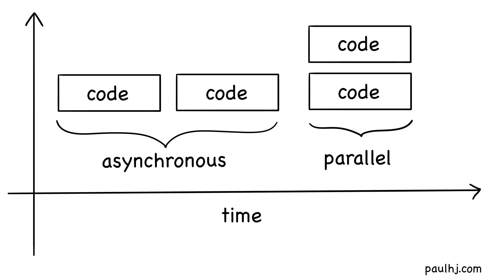
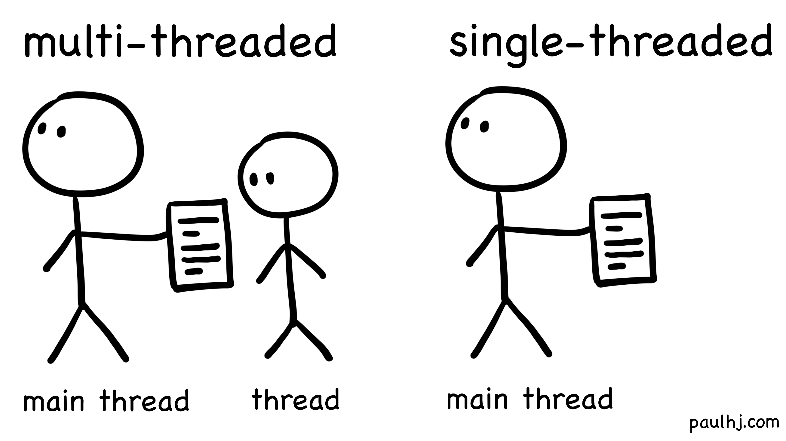

JavaScript is weird.

I’m sure you don’t need me to list the eccentricities and little quirks of JavaScript. From equality checks, truthy and falsy and even writing entire sentences using brackets.
```
(![] + [] + [][[]])[+!![] + [+[]]] + 
  ([][[]] + [])[+!![]] + 
  (![] + {})[+!![] + [+[]]] + 
  (!![] + [])[+!![]] + 
  ([] + {})[+!![] + [+!![]]] + 
  ([][[]] + [])[!+[] + !![]] + 
  (![] + [] + [][[]])[+!![] + [+[]]] + 
  ([] + {})[!+[] + !![]] + 
  (![] + [])[!+[] + !![]] + 
  ([] + {})[+!![] + [+!![]]]
```

The above prints out incredible. Incredible.

And one detail of JavaScript that’s often easy to forget about is that it's single-threaded.
It’s easy to forget about since we litter our code with `async await`s and it’s not until we sit down and think about it - if JavaScript is single-threaded, how can it handle asynchronous code?

Let's dive into the whats and hows of asynchronous JavaScript! In the first section we'll explore what is deciding when to run your JavaScript code. In the second, we'll look under the hood of the lovely syntax `async await` to see exactly how it works behind the scenes.

By the end of this post we'll hopefully understand what's going on with asynchronous code and with our new perspective, gain a greater appreciation for all the orchestration required for something seemingly as simple as `setTimeout`.

# The Environment the Language runs on
The first step to uncovering JavaScript’s secrets is to understand that the question “JavaScript is single-threaded, how can it do async” is like saying “English utilises a 26 letter alphabet, how can it eat pie?”.

English is a language, the person speaking English is the thing doing the pie eating.

Similarly, JavaScript is the language, whatever environment it is running on is the thing doing the asynchronous behaviour.
When we talk about JavaScript environments, we’re mostly thinking of Node or the browser.

Both Node and browsers need a way to read and execute JavaScript code but also a way to schedule what code to run.

The thing doing the executing is called a JavaScript Engine and usually gets the limelight when talking about JavaScript environments.
JavaScript engines like V8 for Node and Chrome, or JavaScriptCore for Safari.
But equally important and often forgotten about is the scheduler, libuv for Node and libevent for browsers - and these heroes are the ones that provide the Event Loop.

# The Event Loop
For our purposes, we can think of the event loop as a continuously running loop that checks a queue for what to run next.

For example, if we had the following code:
```
A();
B();
C();
```
`A()` would be added to the queue, followed by `B()` and then `C()` - so our execution order would be `A()`, `B()`, and `C()`.

To illustrate this execution order in a more concrete flow, let’s say you’re entering your address on a shopping site to see whether they can ship to you.

On entering your address in an input field some validation needs to run, so the browser queues validation code `A()` onto the Event Loop.

Next you click the button to submit your address for the shipping check, so the browser queues sending your address with a network request with code `B()`.

However, this network request will complete at some point, so your browser will register a function to run when the network request returns a response. When the request returns, the browser will queue code `C()` to process the response.

Nothing revolutionary but understanding that your code is chunked and scheduled by the hosting environment to be executed is key to understanding asynchronous JavaScript.

# Async vs Parallel
The second concept to understand is the difference between Asynchronous and Parallel.

Asynchronous is when two pieces of code run at different times.

Parallel is when two pieces of code run at the same time.



It’s a big difference, and if we inspect the Event Loop we can see that it is Asynchronous but not Parallel.
At no point is the Event Loop scheduling the JavaScript engine to run two pieces of code at the same time , however, the Event Loop is extremely Asynchronous. Your code is broken up into chunks that are scheduled to run at different times on the JavaScript Engine.

A common example that illustrates the workings and flaws of this approach is how `setTimeout` is handled.
Let’s take this innocuous looking piece of code:
```
A();
setTimeout(B(), 1000);
C();
```
Before we dive into how this code is executed, let’s remember back to our previous `A()`, `B()`, and `C()` example from the Event Loop.
If we queue in functions `A()`, `B()`, and `C()` we get the execution order `A()`, `B()`, and `C()`. Simple enough, but that was synchronous code.

The above example is asynchronous code, the function `B()` will only be executed after 1000 milliseconds. But what will the execution sequence look like?

Remembering that your code is chunked and scheduled by the hosting environment:
- First `A()` is added to the queue
- The hosting environment sees that `B()` should only be executed after 1000 milliseconds, so `B()` is not added.
- `C()` is added to the queue.
- After 1000 milliseconds, `B()` is added to the queue.

So the execution sequence is `A()`, `C()`, and `B()`.
This means that all synchronous code in your program will run first as they are added to the queue first. Which also means that your asynchronous code is never guaranteed to run exactly when you want it to, only that it will run AFTER the desired time.

`setTimeout` will guarantee that `B()` is added to the queue after 1000 milliseconds, but if there are many items to run before `B()` then it may take much longer for `B()` to after run.

But wait a minute, can’t we interrupt whatever code is currently running and run `B()` exactly after 1000 milliseconds? Alas no, another quirk of JavaScript is that once a chunk of code is scheduled to run, it will run until it finishes.

So if `C()` is particularly large and will takes a whole minute to finish, then `B()` will just have to wait until `C()` finishes - this behaviour is called Run-to-Completion.

With that, we can conclude the first section of exploring asynchronous JavaScript. Our hosting environment is the thing that schedules chunks of our code to run at differing moments in time to achieve async; so let's take a quick detour before heading into the nitty gritty concepts that enable us to write asynchronous JavaScript code, and explore the types of work that can be asynchronous.

# Types of Works [CPU and I/O Bound]
While crafting absolute masterpieces through the medium of JavaScript, you may have realised that some asynchronous operations seem to freeze your magnum opus while others don't.

And that's the difference between CPU and I/O bound tasks.

CPU bound operations are computationally intensive and require the time on the CPU. So for our JavaScript program, it is a chunk of code that runs on the single-thread and nothing else can run until it finishes.

On the other hand, I/O bound operations are not computationally intensive and mainly require waiting (the response from a network request). So it's code that runs (sends a network request), waits, and when ready (network request returns a response) the operation finishes.

Since CPU bound operations require time on the CPU, multi-threaded languages can pass work off to another thread so the main thread doesn’t hang.

For a single-threaded language like JavaScript, doing the these operations means nothing else can run until it's finished. If you’ve ever done heavy computation (manipulation of a large data set) on your site and seen it freeze, this is what’s happening. And remember, due to JavaScript’s Run-to-Completion behaviour, another function can’t interrupt the CPU bound task to get time on the main thread.



Side note: Traditionally, for this reason JavaScript isn’t used when you know you have to do large CPU heavy operations, however, recently Worker Threads have been added to Node (Hosting Environment) that spawns more JavaScript Engine instances to handle CPU bound operations out of the main thread.

All this talk about being unable to interrupt runing tasks may have you thinking, how is it that I'm able to write `async await` in the middle of my functions?
If I’ve understood this right, my function will suspend execution on the `await`, let other chunks of code run and then resume execution when the asynchronous operation has completed - which means that JavaScript’s Run-to-Completion policy is being completely broken!

And you’re completely correct - but to understand how we’re breaking Run-to-Completion to write asynchronous code that looks like synchronous code, we'll have to cover a few JavaScript concepts.

Which brings us to our second section - starting with!

# Callbacks
Callbacks are the backbone of asynchronous JavaScript and it's simply a function that runs when the asynchronous operation has completed.
For example:
```
networkRequest('…', function () {
	// operations to do in the Callback
});
```
When `networkRequest` successfully resolves, the Callback function is added to the Event Loop’s queue to be executed.

It’s a simple mechanism and while it may be tempting to end it there and only use Callbacks, there are some pretty hefty downsides to using Callbacks.

## Pyramid of Doom
Say you have multiple `networkRequest` operations that depend on each other in order to calculate a result.

In order to write that with purely Callbacks, it would look like this:

```
networkRequest('…', function(resultOne) {
	networkRequest('…', function(resultTwo) {
		networkRequest('…', function(resultThree) {
		});
	});
});
```

I need to go wash off after writing this.

## Inversion of Control
Take a closer look at exactly what happens when you write a Callback.

Where are you specifying when and how the Callback should be called?
You’re not.

You are handing control over to the calling function (which in many cases is a third party function you have no control over) to handle when and how the Callback function is invoked.

It could be invoked zero or how ever many times, which is especially troubling if you’ve got application critical logic in a Callback that has to run an exact number of times (e.g. state updates, transactions, logging, etc).

On a more subtle level, how can you tell whether the Callback is going to be synchronous or asynchronous? All we’re doing is sending a function as a parameter into another function, it may be called straight away and this is a problem since the order of function execution can change the final result.
Take for example the following:
```
A();
someFunction('…', B());
C();
```

If `someFunction` is synchronous then the order of execution is `A()`, `B()`, `C()`;
If it’s asynchronous then it’s `A()`, `C()`, `B()`;

You can see how not knowing whether your Callback is called synchronously or asynchronously can result in bugs that are incredibly difficult to diagnose.

# Promises
Promises are an alternative to Callbacks for writing asynchronous code that solves the prior’s style and control issues - and you write them like this:
```
const promise = new Promise((resolve, reject) => {
  setTimeout(() => {
    resolve('data');
    // or reject('error');
  }, 500);
});

promise
	.then((data) => console.log(data))
    .catch((error) => console.log(error))
```

A Promise can either be pending (hasn’t started or ongoing), fulfilled (success) or rejected (failed).

In the above example, the promise will resolve after 500 milliseconds when the `resolve` function is called by `setTimeout`. When a Promise is resolved, the `then` function will be queued which will call `console.log(data)`.

Vice versa, if the Promise errors out, `reject` will be queued in which case the `catch` function is invoked and thus logging `error`.

This is great and all, however, the eagle eyed among you may have spotted the Callback in our asynchronous operation `setTimeout` and be wondering how Promises solve any of the issues previously highlighted about Callbacks.

## Pyramid of Doom
Recall that our sequences of asynchronous operations using purely Callbacks looked like this:
```
networkRequest('…', function(resultOne) {
	networkRequest('…', function(resultTwo) {
		networkRequest('…', function(resultThree) {
		});
	});
});
```

Not only is this code ugly, it’s hard to reason with.

Promises can be chained to create a sequence of asynchronous operations as `then` returns a new Promise that automatically has the previous Promises’ return value as its parameter.
```
const promiseA = new Promise((resolve, reject) => resolve('a'));

const promiseB = promiseA.then((data) => {
	console.log(data); // a
	return 'b';
});

const promiseC = promiseB.then((data) => console.log(data)); // b
```
To handle an asynchronous operation, all we have to do it is return a Promise instead:
```
const promiseA = new Promise((resolve, reject) => resolve('a'));

const promiseB = promiseA.then((data) => {
	console.log(data); // a
	return new Promise((resolve, reject) => {
		resolve('b');
	});
});

const promiseC = promiseB.then((data) => console.log(data)); // b
```
And since each `then` returns a Promise, we can pretty this up by chaining the new `then` directly:
```
const promiseA = new Promise((resolve, reject) => resolve('a'));

promiseA
	.then((data) => {
		console.log(data); // a
		return new Promise((resolve, reject) => {
			resolve('b');
		});
	})
	.then((data) => console.log(data)); // b
```
Much better! Now each additional operation won't add an indent and it's a lot easier to reason with.

## Inversion of Control
The second problem with Callbacks was control being taken away from us and given to the (often third party) function.

The function may call our operation more than once or not at all, but that's fine as Promises can only be resolved once - if the Promise is resolved again it is simply ignored.

So in our `setTimeout` example:
```
const promise = new Promise((resolve, reject) => {
  setTimeout(() => {
    resolve('data');
    // or reject('error');
  }, 500);
});
```
If `setTimeout` decides to call `resolve('data')` twice, the second invoke is ignored.

On the other hand, Promises provide a way for asynchronous operations to time out if they haven’t been resolved or rejected after a certain period of time:
```
Promise.race([
	new Promise((resolve, reject) => {
		setTimeout(() => resolve('data'), 2000);
	}),
	new Promise((resolve, reject) => {
		setTimeout(() => reject('error - timeout'), 1000);
	})
])
.then(() => {
	// success
})
.catch(() => {
	// reject or timeout
});
```
In this scenario, the Promise will timeout as our asynchronous operation won’t finish before the 1000 millisecond timeout specified in the race.

This way, we can ensure that our Promise resolves/rejects even if the Callback never calls our provided resolve/reject functions.

Our second scenario was not knowing whether the Callback will be called synchronously or asynchronously - recall the following resulting in inconsistent execution orders based on whether the Callback is done asynchronously:
```
A();
someFunction(…, B());
C();
```
This isn’t a concern for Promises as `then` and `catch` will always be called asynchronously, even if the resolve/reject was called immediately.
```
A();
const promise = new Promise((resolve, reject) => resolve());

promise.then(() => B());
C();
```
Even though in the above example `resolve` is called synchronously, the execution order will be done as if it was asynchronous - `A()`, `C()`, `B()`.

# Generator Functions
Using Promises we’ve been able to solve a lot of pain points associated with asynchronous code and Callbacks.

But.

Wouldn’t it be great if our asynchronous code looked like our synchronous code?

Promises are great and definitely have their place, but it still takes some brain power to reason with as their flow is different from our synchronous code which runs sequentially.

That’s where Generator Functions come in - and not to spoil the fun but they’re the backbone of how JavaScript (starting from ECMAScript 2017) handles asynchronous functions.

Generator Functions return an iterator that you can control by invoking a function.
For example:
```
function *createGenerator() {
	yield 1;
	yield 2;
};

const generatorFunction = createGenerator();
console.log(generatorFunction.next().value); // 1
console.log(generatorFunction.next().value);  // 2
```
The `*` next to `*createGenerator()` indicates that this is a Generator Function. When we call `createGenerator()` we are constructing a Generator object where we can call `next()` to iterate through the function.

The first `next()` call starts the function and will continue until it hits `yield`. `yield`s can return a value just like `return` and in this case returns `1` - which we can access with `.value`.

Calling `next()` again resumes the Generator Function from where it left off and will continue until it hits another `yield` or until the function ends (which will have an implied `return undefined` just like a regular function).

This may not seem like much but it’s ground breaking.
We can stop a running function and control when to resume it!

Remember, JavaScript’s Run-to-Completion behaviour means that a function can’t be interrupted once started, but here we have a function where we can suspend/stop the function from running with the `yield` expression. By breaking Run-to-Completion we’re able to open the door to make our asynchronous code look like synchronous code - but more on that later.

And since Generator Functions are still functions, they can be passed parameters and provide a return value.
```
function *createGenerator(initialValue) {
    const num = initialValue + (yield);
    yield num;
}

const generatorFunction = createGenerator(10);
generatorFunction.next();
console.log(generatorFunction.next(15).value); // 25
```
When calling the `createGenerator` we pass in the initial value of `10`, and to start the Generator Function we call `next()` which will run the function until `(yield)` - at this point `value` will return `undefined` as we aren’t returning anything.

The next call passes in `15` which will replace the paused `(yield)` expression with `15` resulting in `num` becoming `25`. The Generator Function then continues until the next `yield` expression - which this time does return the value `num`.

Now that we understand how Generator Functions work, we can start merging them with asynchronous code.

Let's first create a Callback based implementation:
```
function asynchronousOperation(callback) {
    setTimeout(() => callback(), 3000);
}

function main() {
    asynchronousOperation(() => {
        console.log('Async operation complete');
    });
};

main();
```
Here our asynchronous operation `setTimeout` is simply calling our Callback when it finishing running - nothing new here.

Now let’s do the same thing utilising Generator Functions:
```
function asynchronousOperation() {
    setTimeout(() => {
        generatorFunction.next();
    }, 3000);
}

function* main() {
    yield asynchronousOperation();
    console.log('Async operation complete');
}

const generatorFunction = main();
generatorFunction.next();
```
There’s a lot going on here so let’s unpack this step-by-step.
1) Our `main` function has now become a Generator Function.
2) We create our Generator Function by calling `main()` and start it up by calling `next()`.
3) `main` will run until it hits the first `yield` expression and runs `asynchronousOperation()` then suspends (`asynchronousOperation` doesn’t return anything so `value` will be `undefined`).
4) `asynchronousOperation` has been called so `setTimeout` has been called.
5) After 3000 milliseconds, `setTimeout` calls `next()`.
6) This resumes the Generator Function from where it left off previously, logging `Async operation complete`.

This may seem more complex but look at the difference of the two `main` functions:
```
function main() {
    asynchronousOperation(() => {
        console.log('Async operation complete');
    });
};

function* main() {
    yield asynchronousOperation();
    console.log('Async operation complete');
}
```

Both are dealing with asynchronous operations but the Generator Function implementation looks like synchronous code!

To take it a step further, let's say that the asynchronous operation was requesting a resource.

Callbacks:
```
function asynchronousOperation(callback) {
    networkRequest('…', (response) => callback(response));
}
function main() {
    asynchronousOperation((response) => {
        doSomethingWithResponse(response);
    });
};
main();
```

Generator Functions:
```
function asynchronousOperation() {
    networkRequest('…’', (response) => generatorFunction.next(response));
}
function* main() {
    const response = yield asynchronousOperation();
    doSomethingWithResponse(response);
}
const generatorFunction = main();
generatorFunction.next();
```
With this the Generator Function implementation takes the lead again for asynchronous code that looks like synchronous code.

Remember that we can pass parameters into `next()` so `requestResource` passes `response` with `next(response)` which passes it to the `response` variable in `main`.

Look at that `main` function! We’re getting a result from an asynchronous operation and passing it to our next function while the whole thing looks synchronous - in single-threaded JavaScript land!

However, our above implementation lost the trustability we got when we used Promises. So the final piece of the puzzle is to combine Generator Functions with Promises.

That turns out to be pretty simple, instead of the Callback iterating the Generator Function we let the reject/resolve from the Promise do that instead.
```
function asynchronousOperation() {
    return new Promise((resolve, reject) => {
        setTimeout(() => resolve('Promise data'), 3000);
    });
}

function* main() {
    const response = yield asynchronousOperation();
    console.log(response);
}

const generatorFunction = main();
const promise = generatorFunction.next().value;

promise.then((data) => generatorFunction.next(data));
```
To unpack:
1) Our Generator Function `main` is constructed.
2) We run `next()` which runs `main` until it hits yield, which runs `asynchronousOperation`.
3) `asynchronousOperation` returns a Promise, which we access with `value`.
4) After 3000 milliseconds, `setTimeout` resolves `resolve(‘Promise data’)`.
5) Resolving the Promise results in `then` calling `next(data)` with the resolved data.
6) `main` is resumed with `data` inserted into the `yield` expression, which assigns it to `response`.

We can even add error handling and make it look synchronous with a couple of steps:
```
function asynchronousOperation() {
    return new Promise((resolve, reject) => {
        setTimeout(() => reject('Error message'), 3000);
    });
}

function* main() {
    try {
        const response = yield asynchronousOperation();
        console.log(response);
    } catch (e) {
        console.log(e);
    }
}

const generatorFunction = main();
const promise = generatorFunction.next().value;

promise
    .then((data) => generatorFunction.next(data))
    .catch((e) => generatorFunction.throw(e));
```
Instead of `asynchronousOperation` resolving, it now rejects with `Error message`.

We catch the exception like we usually do in the `catch` statement, however, we take it a step further by throwing the exception with the `generatorFunction`. Then we can wrap our `main` function with a `try catch` like we do for synchronous code!

Now we’ve got synchronous looking asynchronous code with the trustability we get from Promises!

Exceeeept.

This is a lot of boilerplate code to do one asynchronous operation. If only there was a better way.

The good news is that starting from ECMAScript 2017 `async await` was introduced, and to do what we’ve done above with `async await`:
```
function asynchronousOperation() {
    return new Promise((resolve, reject) => {
        setTimeout(() => resolve('Promise data'), 3000);
    });
}

async function main() {
    const response = await asynchronousOperation();
    console.log(response);
}
main();
```
Does that look familiar? Instead of `*` we have `async` and instead of `yield` we have `await`.

There’s a lot more that goes on behind the scenes to make this `async await` syntax work, but the this is essentially it! We’ve used the code suspending control flow from Generator Functions and trustability from Promises to make asynchronous code that we can reason with like synchronous code!

---

And that's async in JavaScript!

From the syntax that makes writing asynchronous code easier and prettier, to how that code gets scheduled to run on the hosting environment.

Even though JavaScript is single-threaded, lots of details behind the scenes make life for us JavaScript developers a lot easier when it comes to writing asynchronous code.

Just make sure it's not a huge CPU bound operation you've scheduled in.

