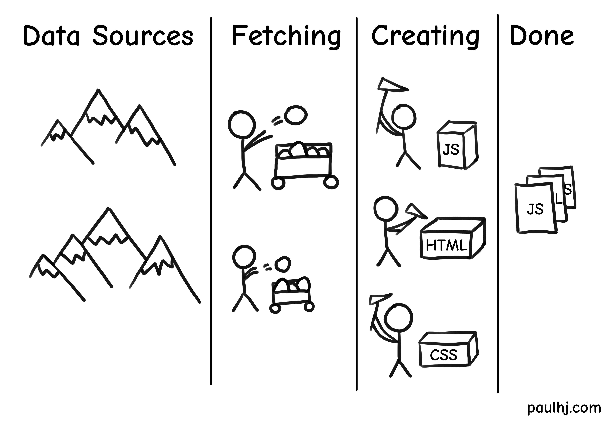

How did this web page get built and sent over to you?

If you aren’t a seasoned front-end developer, this question might seem trivial or, dare I say, unimportant. However, there are vast differences between various methods of getting a web page to a client, each with their own pros and cons from the big to the little.

So let’s get down into the weeds on the three main ways sites are rendered and delivered these days:
1. Client Side Rendering
2. Server Side Rendering
3. Static Rendering

There’s a lot of stuff that happens when rendering a site, but what we want to focus on are the areas that make these rendering methods different - those being:
1. Fetching Data (Database queries, API requests, etc).
2. Creating the HTML, CSS and JS files.

So we’ll be defining the “work” as the process of __fetching data and creating the requisite files.__

Creating the requisite files may sound like an unnecessary step. After all, as developers don’t we create the files in our IDEs?

If we can predict what every page will look like during development, this is a viable option (foreshadowing for static rendering). However, there are many sites where the content is unknown at the time of development - such as, social media feeds and shopping catalogues. 
In these cases, the end files are created after the user requests for the page.

We’ll first explore the two rendering options that are equip to deal with uncertainty.

# Client and Server Side Rendering

Personally, the thing that made exploring these different rendering options confusing was the broadness of the definitions.

If any rendering occurs on the client (the user’s device/browser), then the website is considered to be using Client Side Rendering. Vice versa, if any rendering occurs on the server (the machine that responses to the client’s request), then it’s considered Server Side Rendering.

The broadness makes these options confusing as a website doesn’t have to be fully rendered on the server side to be considered Server Side Rendered, the same for Client Side Rendering. 
Furthermore, just because a site uses one technique doesn’t mean it cannot employ the other.

Let’s use some examples to illustrate what this means.
1. All the work is done by the client’s device, no server is involved here. This is Client Side Rendering.

2. All the work is done by the server, no client is involved here. This is Server Side Rendering.

3. Work is done on both the client and server. This is both Client and Server Side Rendering. 
Technically, this is Universal Rendering, but we’ll leave this for another time as it’s a topic in and of itself.

So we know what Client and Server Side Rendering is, but why does all this matter? 
This seemingly small decision of where the work is done actually has many consequences.

## Predictability and Uniformity
For Client Side Rendering, you’ll be relying on the client’s device to render your site. Which means, you’ll have to ensure that your code behaves the same way on every device and browser (Internet Explorer flashbacks).

So you’ll have to make sure you’ve ensured the JS features you’ve used are supported by the browsers you’re targeting, if not ensuring you have the correct polyfills in place and then testing your site on a variety of devices.

Server rendered solutions have the advantage here as the rendering is done on one machine within the developer’s control. Depending on your implementation, this can eliminate or drastically reduce the size of your JS bundle, while also knowing how your site will behave on a variety of devices.
## Speed
Performance is similar to predictability, for Client Side Rendering you’ll be relying on the client’s device.

Which isn’t a problem if the client has a computer from the future powered by the sun; but with the majority of internet traffic being from mobile nowadays and the majority of those mobiles not being flagships, you’re making a losing bet when relying on the client.

In addition, even if the client has a super powerful device, what if their internet is flaky? Client Side Rendering sends more JS over to the client and it has to finish downloading in order for rendering to begin.

On the Server Side Rendering end, you as the developer are in control of what device does the rendering. So your performance can be as high as your AWS bill.

However, to muddy the waters, there’s this important metric called Time to First Byte (TTFB).
It measures when the first byte of content is received by the client after they request for it.

In Server Side Rendered solutions, the server has to do the required rendering before it sends the content back to the client. 
In contrast, the server that hosts the Client Side Rendered solution can just send off the content for the client to render - so the TTFB is faster for Client Side Rendering.

Furthermore, your server has to respond to every request which can become a bottleneck, slowing everything else down (you can do tricks here like multiple servers and caching).

All this to mean that Sever Side Rendering == faster, while being true a lot of the time, isn’t an iron clad rule.
## User Experience
Server sided sites send a new batch of files to the user for every request. This results in that white blink as the browser loads in the new files.

On the other hand, client side sites render the pages on the user’s device so new pages are seamlessly transitioned between. And since the JS bundle is retrieving data and rendering the site, changes on the page can be made without refreshing the whole site. 
This results in a much better user experience, making the site feel much more like a native application.

Work is being done and it’s possible to marry the Client and Server side techniques so that sites that utilise Server Side Rendering don’t go through that white blink. Again, a topic for a different time.
## SEO
If you want to do well on the web, you’ll have to bow down and gain favour with the search engine overlords; and in order to do so, you’ll have to ensure your site is well optimised for their crawlers - Search Engine Optimisation.

Search engine crawlers are software bots that search engines use to extract information from the sites they visit. As they visit sites around the web, it indexes information about that site, which the search engine can use to make decisions about which sites to show based on the user’s query.

Exactly how each search engine determines the ranking of each site is a whole other topic - getting your site to the top of a Google search can make or break your company’s profit margins so a lot of effort goes into this stuff.

For our purposes, we just need to know that currently search engine crawlers can’t execute JavaScript (except for Google’s).

So if your site relies on Client Sided Rendering, you’ll need to employ a few tricks to ensure your site can be indexed correctly by the crawlers.
Whereas, Server Sided Rendered sites get this benefit out of the box. 
## Cost
All these points make Server Side Rendering seem like the go to, so let’s talk about some positives for our old friend Client Side Rendering.

The benefit of relying on the client’s device for rendering means you aren’t relying on your own server (duh). Depending on your implementation you can drastically reduce load on your server or take it out entirely. 

So those are the differences for Client and Server Sided Rendering. They both tackle how to build and deliver a site to the client when there is uncertainty on what the client receives due to the content changing based on data.

But what happens when there is no uncertainty? When all users get the same content?

That’s where Static Rendering comes into play.

# Static Rendering

Why bother rendering the end files on every request when all the users get the same content? 
Instead, push the rendering step up the chain and do it once the developer has finished creating the site.

Then host the files on a server and whenever a request comes in, send the files over - no rendering required.

Very little work is being done and so there are a tonne of benefits using this method.

## Speed
The server isn’t doing any work other than receiving the request, finding the correct file, and sending it over.

No rendering work is being done so the server is really a glorified file directory (in fact, you can do some really cool stuff by tricking a storage offering by a cloud provider into thinking it’s a web server to serve your site).

Even cooler, since the content is always the same your cache hit rates will be through the roof! Making the site even faster.
## Predictability and Uniformity
The same concept as Server Side Rendering but with the added bonus of the content being the same for every user.
## User Experience
The user does have to request for a new set of files every time they switch pages, so the white blink refresh is there just like Server Sided Rendering.

And just as with Server Sided Rendering, you can marry Client Sided Rendering techniques with Static Rendering to eliminate that white blink.
## SEO
Your content is rendered and ready for search engine crawlers to crawl all over them.

Not only that, your site is blazingly fast - which should up your search ranking even more.
## Cost
You’ve done the hard work of rendering the files. You just need to put them somewhere where users can request them.

You can lower the costs of server requests even more by utilising caching. With no rendering work and high cache hit rates, the costs for Static Rendering are very low.

---

I had planned to end this post with a nice little chart where answering each question leads you closer to which rendering method to use.

But during the research and writing I remembered how much goes into the seemingly simple outcome of serving a web page. Not to mention all the hybrid approaches which would result in the chart spitting out a “why not both” outcome a frustrating number of times.

As with everything, the answer is “it depends”.

The circumstances you find yourself in will have a myriad of different factors which will affect every decision you make - which will impact every other decision.

I hope that this post has outlined the major differences between the rendering methods so that you can make an informed decision.

And if you think you’ve made the wrong choice, don’t be too hard on yourself. In the world of front-end, everything will be irrelevant in two weeks time anyway.