What are you doing on your computer?  
Browsing many different and interesting things on countless tabs on your browser perhaps?  
What would you do if your Internet went down?
If you’re anything like me you’d feel like the oxygen was drained from the room and you’d finally know what it felt like to be a fish and drown on dry land.
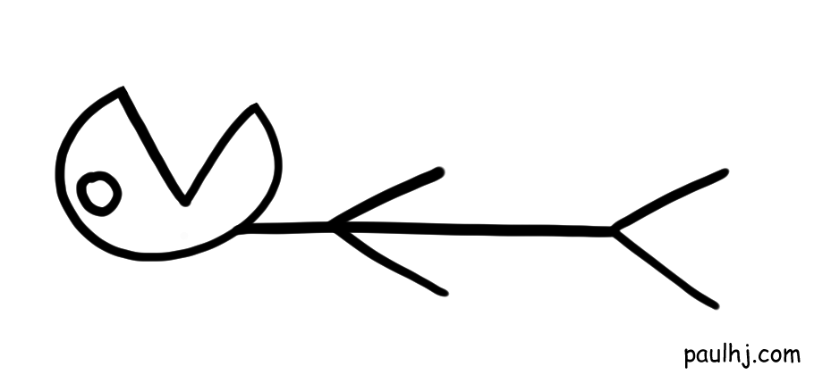
At the centre of our technological wonderland is the personal computer. I don’t say this lightly; the computer is nothing short of miraculous.
However, while our devices are indeed very powerful, just like humans they gain a huge power boost when allowed to communicate and work together. And the biggest, baddest communication group of them all is the Internet.

That being said, whenever I hear or read a sentence with the words IP Address, Subnets, Autonomous Systems or the like, my eyes glaze over and the only thoughts going through my head are “Oh, the people who know what they’re doing are talking”.
So, let’s dive in and learn how the devices that give us superpowers like to talk to each other.

##OSI Model
The technology world is a lot like an onion (and Shrek), it’s all layers; however, that’s not easy to see and reason with - especially as the tech world grows. Without a proper model to conceptualize where each bit of technology sits, it’s all too easy for everything to tangle up and all we’re left with is a big ball of messy yarn (or the cables on my desk).

Which is why the OSI (Open Systems Interconnection) Model exists. The OSI Model takes the technology onion and organizes the layers into seven parts, each with its own responsibility and each layer talking to the one above and below it.

It’s important to note that the OSI Model is a conceptual model not a specification; the structure of Internet doesn’t actually follow the OSI Model exactly, however, it provides a good mental framework for where each piece of technology sits.
For the scope of our exploration, we’ll only be concerning ourselves with the layers one to four.
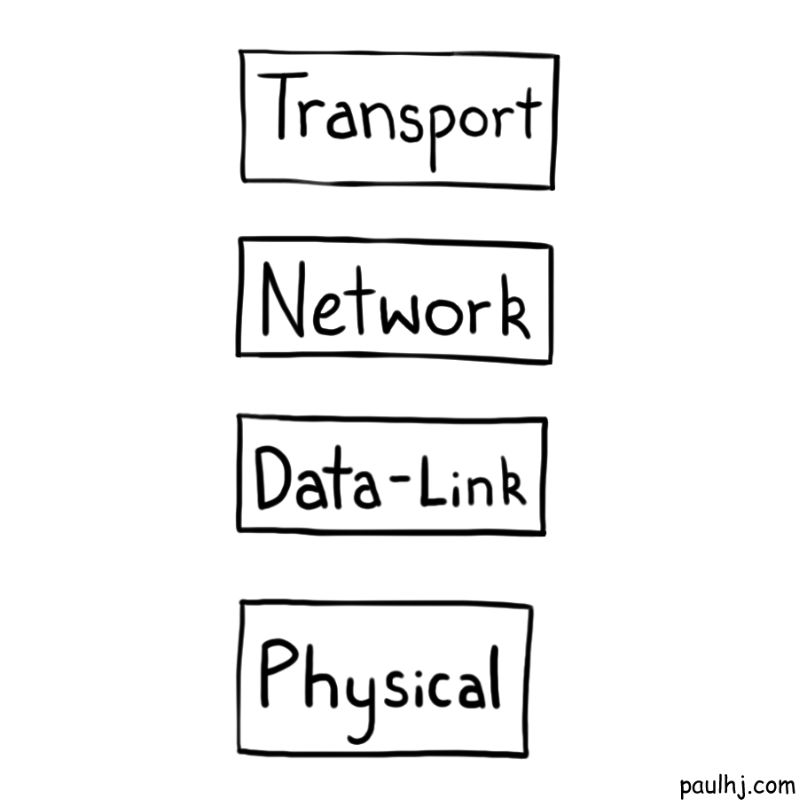
We’ll get to exploring each layer as they become relevant, so for now we’ll look at the bottom of the model for the most self-explanatory layer, the Physical layer.

For devices to communicate they must have a medium for that data to flow. Whatever physical medium that allows data to flow between two devices is part of the physical layer - such as a cable.

For the Internet to work there has to be a physical medium that links together devices around the globe - which is exactly what we’ve done. You can actually see these cables if you search up “Submarine Cable Map” and it blows my mind every time I see it (Seriously, if you’ve been on a flight you know that even traveling at ludicrous speeds it still takes a very long even for what seems like a short distance. Now try imagining for the entire journey there’s a massive cable being thrown out and laid across the ocean. Woah dude).

##Internet Protocol
Now that we’ve established a physical network where data can be transmitted, how does that data get from one device to another in a manner that both devices can understand?

For that we need to look at a piece of the puzzle that literally has the word “Internet” in it - The Internet Protocol.
With that said, the part of the phrase “Internet Protocol” that we’re going to visit is the “Protocol” part. While the word does sound like something serious people would say seriously in serious situations, the word itself is quite loose.

A protocol (in computing terms) is just an agreement on how information should be presented when communicating. On our journey across the Internet lands we’ll be talking to a menagerie of devices; imagine how difficult it would be if all those different devices spoke different languages and dialects. The Internet Protocol is our saviour here, it defines how all those different devices should speak if they want to be understood by each other.
It’s like a zoo where all the animals speak English - except less horrifying but equally magical.

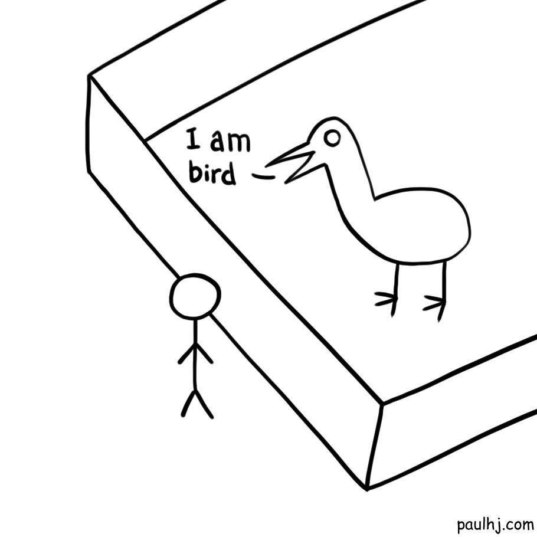

##Internet Protocol Address
But like any information exchange, data must go from one location to another; and for that to work you need a way to identify that location - an address if you will.

You’ve probably already seen one, it’s a series of numbers with periods in between e.g. 172.16.81.100 and it’s called the Internet Protocol Address or IP Address.
Each number in the sequence can only go up to 255 from 0; this is because the IP Address has a total size of 32-bits. This sounds complicated but it makes more sense when we start to look at things the way computers do, in ones and zeros, so let’s do a quick detour from Address Avenue into Binary Boulevard.

##Binary
Computers with all their superpowers are actually a bunch of tiny switches which control the flow of electricity. These tiny switches are called transistors and they deserve a post all their own for all the magic they make possible.

To grossly oversimplify, we can think of a transistor as a switch that lets electricity flow one way or another. As simple as it sounds this is the basis of how information is processed on a computer - as we now have a mechanism for representing that information using metal and electricity.

To understand why this is so key you have to keep two things in mind:

1 - Information processing, whether that’s mathematics or language, requires some way of representing that information in an understandable pattern.  
2 - Unlike us meat-bag biological creatures, the computer is a rock we strike with bolts of sparkly lightning for it to start processing information.
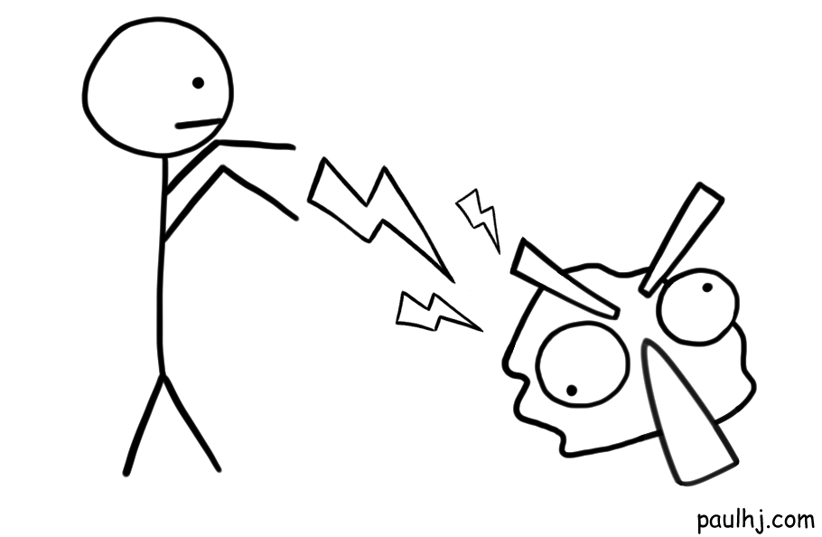

As you’re reading this right now your brain is doing some serious black-magic witchcraft; it understands that these strange squiggly lines are a sort of label for an object or concept. When you see the number two how does your brain represent that information? Again oversimplified, your brain is a tangled mess of neurons; as smart as the human species is, we don’t really know how our own heads store and process information.

So, when it came time to create the computer we couldn’t look to our brains and copy what it does, we had to create a new way to represent information. The key being the ability to turn an electrical signal on or off with the transistor.
When there is no signal that is represented as 0, when there is a signal that represents 1.

That’s all well and good but how do we represent two? Well for that we need another 0 or 1, so 1 0 defines a two and 1 1 a three. Representing up to the number three is a 2-bit size operation as there are two 1 or 0 spaces.

##Back to Internet Protocol Addresses
Armed with the knowledge of binary, understanding the Internet becomes much easier. The 32-bit IP Address size makes much more sense, it simply means that there are 32 one and zero spaces to represent the address information.
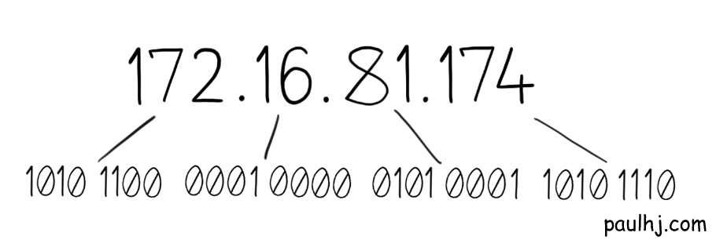
Each number in the sequence is 8-bits, with 0000 0000 equalling 0 and 1111 1111 equalling 255, so IP Addresses can range from 0.0.0.0 to 255.255.255.255.

Great! Now we know how devices on the Internet are identified. However, you may be scratching your head from looking at that range of addresses and be thinking “For a global network, that doesn’t look like a lot of available addresses” and how right you are.

We can calculate how many unique addresses can be formed using a little maths (math). Remember that those numbers in the sequence can be represented in binary - which totals 32 spaces for ones and zeros. And since each space can only be a one or zero, we can find the number of unique addresses by using the power of powers - 2 to the power of 32 to be precise (232).

Which gives us a total of 4,294,967,296 unique addresses.

In the early days of the Internet this was just fine as there were only a limited number of devices. However, in the futuristic year of 2019 (seriously considered delaying this post by one year for a “hindsight is 2020” pun) a smart phone is seen as a necessity and it’s more common than not for people to own multiple devices, which all connect to the Internet.

If we don’t fix this problem, there won’t be any more room on the Internet, and we’ll all drown on dry land! Well, spoiler alert we did fix it, but how we did it is much more interesting.

Since we didn’t want to drown on land, we solved this issue in many ways. Since this post is about how devices communicate on the Internet, we’ll be focusing on a solution relating to networks, however, it’s worth mentioning one of the solutions as you’ll be seeing it around and it may cause some confusion, IPv6.

The IP addresses we’ve been discussing have all been IPv4; IPv6 addresses look like this 2001:0db8:0000:0042:0000:8a2e:0370:7334 and they have 128-bits, which means they have 2128 unique addresses (put that into a calculator for fun times - we won’t be running out anytime soon). IPv6 isn’t simply an “if there’s no room let’s just make more room” solution; it has its differences and nuances, however, that’s a story for another time.

##Networks
To explain how the network related solution works we have to explain what a network and subnetwork is. A network is a collection of IP addresses (devices) and a subnetwork is a subset of that network. Put another way, a subnetwork is what occurs when you start splitting the network into smaller groups. However, this begs the question, how do we split these addresses into groups? How can we identify if one address belongs to one subnet or another?

To identify something that belongs to a group, we need to be able to do two things:

1 - The group and object must share a piece of information that matches them together.  
2 - An operation to map those two pieces of information together.  

A real-world example of the first point is a brand of phone and the name of that phone. For example, Gaggle jPhone 23s XL Pro Lite Red. The matching information being the brand name Gaggle. Obviously.

The same thing occurs in the world of IP Addresses; the first point is addressed by splitting the IP Address into two parts, the Network and Host Address.
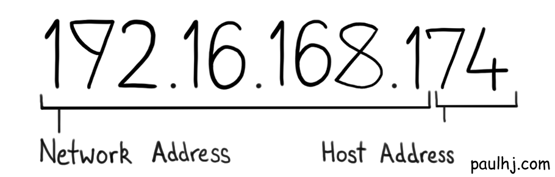
As the names suggest, the Network Address indicates what network the IP Address belongs to, while the Host Address identifies the device on that network.

Using the above example, it would be intuitive to say that the Network Address is 192.16.168.1 and the Host Address 74, however, that isn’t the case as the separation between the two is in binary. If that’s the case how do we get the Network Address from an IP Address so we can start grouping them together?

This brings us to our second point, and the operation involves a lot of numbers and looks very complex, however, it’s actually quite simple.
The first piece of the puzzle is something called a Subnet Mask and it looks like this.
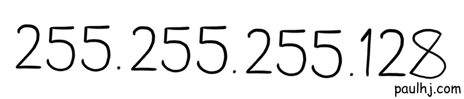
You’ll notice that it looks a lot like an IP Address and that’s due to how it was created. Firstly, we convert our IP Address into binary, so we get this:

Then, for all the spaces that belong to the Network Address, make that a one. All other spaces (the Host Address spaces) turn into a zero.
In the end we get this:
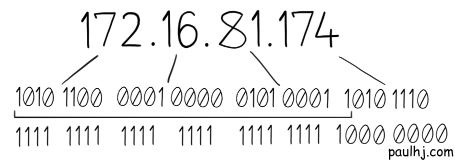
And if we convert that back, we get the Subnet Mask.
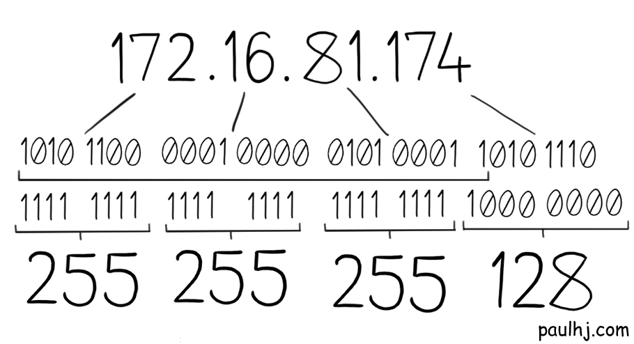

Great! But how do we use it to get the Network Address? First, we align them like so:
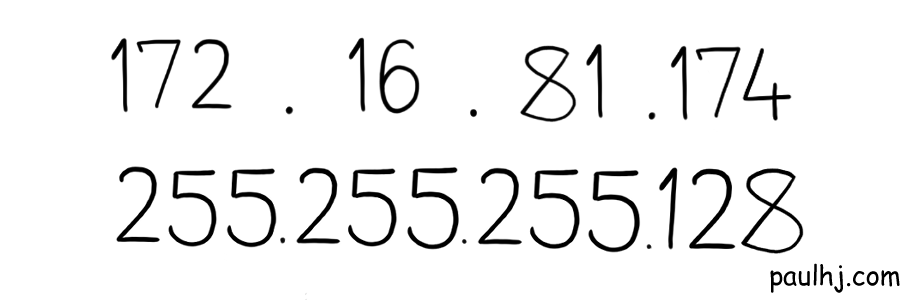
But this isn’t helpful as the actual operation occurs in binary. So, let’s convert both the IP Address and Subnet Mask into binary while keeping them aligned.
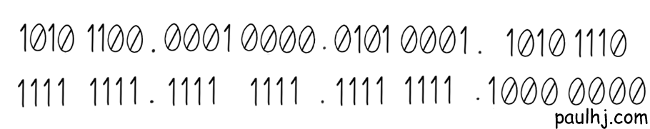
Whew, there are a lot of numbers here and whenever that happens I feel the urge to either bring out my calculator or run away. Thankfully, we don’t need to do either here as the operation is a simple two step process:

1 - If both vertical spaces are one, then the output is one.  
2 - Otherwise, zero.

Doing so, the output of our example is:
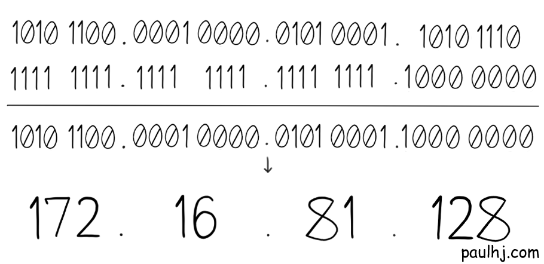
This is called a Bitwise And operation and the output of this is the Network Address of the IP Address. So, for every IP Address we perform this operation and if they have the same Network Address they belong to the same network.

With our previous example, the Network Address would be 172.16.81.128, allowing for Host Addresses from 172.16.81.129 to 172.16.81.254 (not 255 as something called a Broadcast Address takes 255).

To further our example, let’s say we just received an IP Address of 172.16.81.126
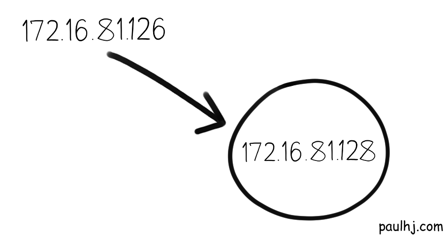
We want to know whether that IP Address belongs in our subnetwork, so we do the same exact operation with our Subnet Mask.
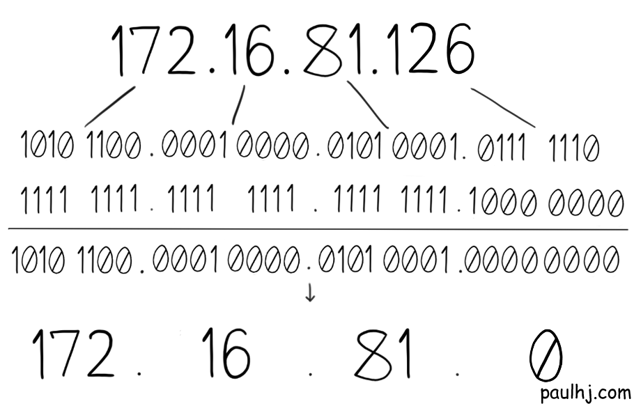
The Network Address is not the same, so this IP Address does not belong to this subnetwork.
Now if we visit another subnetwork with a Network Address of 172.16.81.0
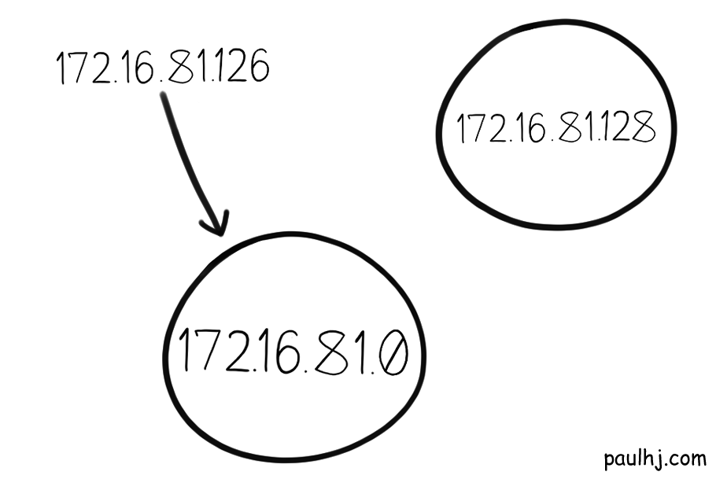
And we do the same operation.

The Network Address is the same, so it belongs to this subnetwork.

##Classful Networks
Splitting the IP Address into two parts has some interesting consequences, mainly on how big a subnetwork can get. Within a subnet a device is given an IP Address with a unique Host Address, so the number of unique Host Addresses you can assign becomes the size limit of your subnetwork.

The bigger the Host Address part of the IP Address, the bigger your subnetwork can become. Remember that our calculation for the amount of unique IP Addresses involved two to the power of number of bits, 232. The same calculation can be used to find out the number of unique Host Addresses that a subnetwork can provide.

There are 32 total binary bits in an IP Address, so we subtract the Network Address bits from 32 and what we have left is for the Host Address.

For example, we have an IP Address 172.16.81.0 and 24 bits are allocated for the Network Address, which leaves 8 bits for the Host Addresses and so there can be a total of 28 (256) unique addresses assigned on the subnetwork. So, a subnetwork with 24 bits assigned to the Network Address can support 256 devices (it’s actually 254 devices as the Network and Broadcast addresses take one each).

Keeping in mind that the Internet was running out of space the last thing we want to do is use the available IP Addresses inefficiently. So, something we certainly didn’t want to do was be sloppy and wasteful about assigning subnetwork sizes. Which is exactly what we did.

Back in ye olde days, we did something called Classful Networks as a way to divide networks into subnetworks. There was a total of five classes but the ones we’ll concern ourselves over are classes A, B and C. Each class had a different Network Address size which dictated the number of devices that subnet could support.
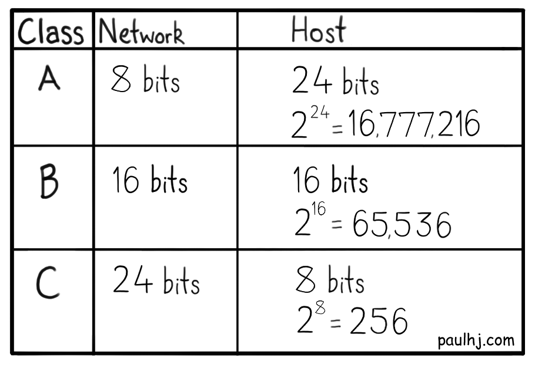

To see why this was so wasteful imagine this.
You’re an organization and want your own subnetwork. You start with a class C subnetwork that can support 254 devices. All is well and good until Dave comes along.
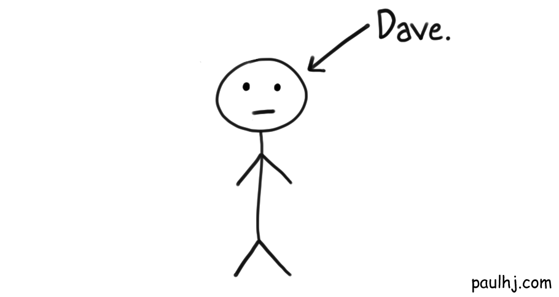
Your organization has been doing well selling those Bluetooth enabled cakes. So well in fact that you’ve decided to hire more software engineers to help with the cake baking. And that’s where Dave comes in.
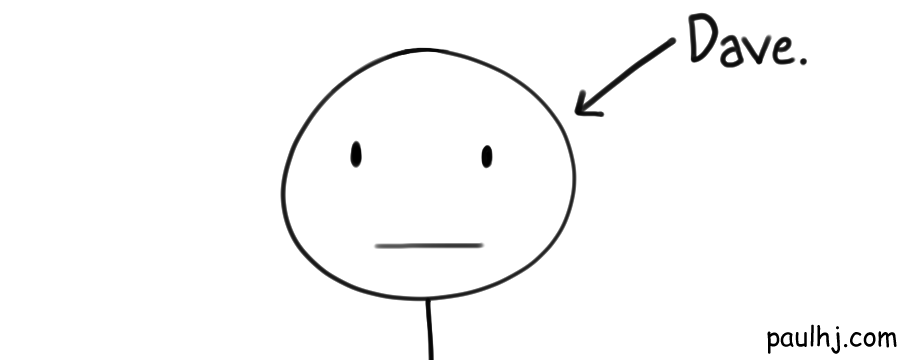
Dave isn’t just any employee. He’s employee number 255. And he’s got a laptop. That he wants to connect to your subnetwork. Badly.

Here you see the problem. Your class C subnet only supports 254 devices, so in order to support Dave you’ll have to upgrade to a class B subnetwork - which supports 65,536 (216 but really 65,534) devices. That’s 65,277 IP Addresses just sitting there being useless because the jump from class C to B was so high. Bloody Dave.

##CIDR
Obviously the solution here would be to have more fine-grained control over the subnetwork size. Enter stage left, CIDR (Classless Inter-Domain Routing).

As the name suggest, CIDR does away with classes and allows for an IP Address to be separated on any bit.
Taking our previous example, the class C subnet had 24 bits allocated to the Network Address and upgrading to class B meant allocating 16 bits. That’s an 8 bit jump which is why there were so many wasted IP Addresses.

Using CIDR, you would be able to accommodate more devices by allocating 23 bits to the Network Address, which would allow for 512 (29 but really 510) devices. Much more fined grained and efficient use of IP Addresses.

To indicate how many bits you’re allocating to the Network Address we use something called CIDR notation. Simply take the IP Address and add a slash with the number of bits for the Network Address, e.g. 172.16.81.0/24.

Whew, that was a lot of maths (math) and I promise that’s the most of it we’ll be doing in this post; but now we know what the addressing system for the Internet looks like and how it works. However, what’s actually passed between devices? We’ve just been saying “data” this whole time, what exactly is this data?

##Protocol Data Unit
Let’s bring our onion back and remind ourselves of its layers. We’ve discussed the Physical layer so that leaves the Data-Link, Network and Transport layer, and each of these layers has their own format of data that they pass around.

While each of these formats have their own name, all of them fall under the definition of something called a Protocol Data Unit (PDU). However, when a PDU travels to a layer below it, it is now called a Service Data Unit (SDU) with the lower layer’s data format becoming the PDU.
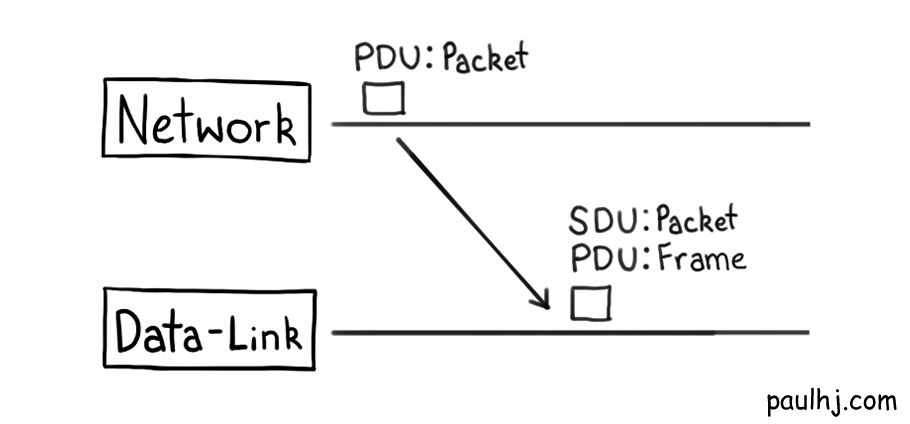

To begin, we’ll have a look at the PDU of the Internet Protocol, which is called the Internet Protocol Packet (IP Packet).

Referring back to our onion, the IP Packet is used on the Network layer as the Internet Protocol is a Network layer protocol. This might get you thinking “wait, so there are other protocols for the other layers? So the Internet doesn’t just run on the Internet Procotol?”; and if you thought that you get a super special gold star of approval because that is exactly what happens. The combination of all the protocols is referred to as the Internet Protocol Suite.

The Network layer that the Internet Protocol works on is dedicated to communication between different networks (remember our different subnetworks). The Data-Link layer is very similar to the Network layer except it’s responsible for communication between devices on the same network.

After the IP Packets have travelled through the Internet, passed many different networks and has finally arrived at your home network, the Data-Link layer comes into play to transform and transmit that IP Packet to your device.

The PDU (IP Packet) sent by the Network Layer (Internet Protocol) is sent down to the Data-Link layer and becomes a Frame (the Data-Link layer’s PDU). These Frames are then transmitted to your device using Data-Link layer technologies, probably Ethernet, not the Internet Protocol.

As a side note, the PDU of the Physical layer is a bit, those ones and zeros.

Getting back to our IP Packet, it looks a little something like this:
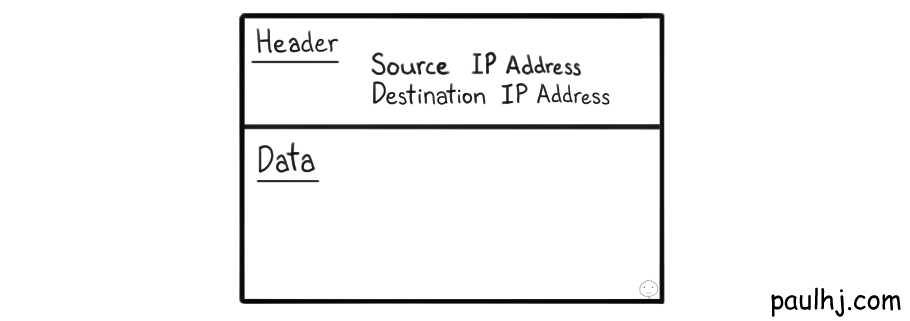

Okay, it’s a very simplified IP Packet but it gets the point across. The data to be sent has a header attached to it and it contains information for how to transport this piece of data, such as the IP Address of the source and destination.

However, the more interesting fact is that the data isn’t complete - an IP Packet only contains a fraction of the complete data. That means whenever a piece of data has to be sent, the data is split and multiple IP Packets are created and sent over the network.

If you’re anything like me (then firstly I feel sorry for you) there’ll be three burning words on your mind right now - but why though?

Why bother going to the trouble of splitting the data? That just means you’ll have to reassemble them at the other end, which sounds like a lot of work.

To reason through this let’s say we pass the data as one whole chunk through the network. To travel through the network and arrive at your computer a variety of processes occur to the data; and whether in the digital or real world, whenever you have to process something, if that something is larger then it’ll take more time to process.

This can cause problems when multiple pieces of data have to be processed, as the time to complete processing varies depending on the size of the data. This can result in other data being blocked and queued behind a large piece of data being processed. As you can guess, this can be problematic for time sensitive operations as the delay between request and fulfillment can vary greatly depending on what other pieces of data are floating around in the network.

There’s also the issue of recovering from an error. During any point in its journey, the data can end up becoming corrupted. If the data was split into IP Packets, then the corrupted packet can be retransmitted rather than the whole piece of data.

Now that we understand the motivations for splitting into packets, we have to be careful about splitting too much. Each packet needs a header, so we’re sending more data through the network the more packets we create. So, we end up doing less processing the fewer packets we create.

The maximum size of a PDU (in our case the IP Packet) is the Maximum Transmission Unit (MTU). Each layer has its own MTU and if an SDU is larger than that layer’s MTU then it will be split, which results in more processing. As you can see finding the optimal MTU is an art in itself, so we’ll leave that for another time. For our journey, all we have to know is that data gets split into differing sizes depending on the MTU of that layer’s PDU.

##Routing
There’s one final aspect of the Internet Protocol that we need to cover before we wrap up onto the fourth layer. So far, we’ve covered how to identify networks and how data is prepared for transmission, however, we haven’t covered how the data navigates the different networks to reach its destination.

To explore this area, we first have to determine how devices are setup on a network. Devices on a network don’t communicate to other networks directly, they all connect to another device which does all the communicating, this device is called a Gateway.

A Gateway is a device that passes data between two different networks, even if they use different protocols (on different layers). Having all devices connect and communicate through a gateway has several advantages. Such as, being able to apply rules and actions, such as a firewall, to just one device. Instead of applying the rule to every single device on the network, apply it to the gateway and all devices now follow that rule.
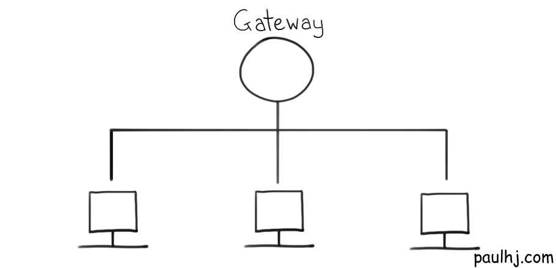

When we send a request, the data first makes contact with the Gateway using Data-Link layer technology. A check is done to see whether the destination device is in the network. If not, the request now becomes the responsibility of the Network layer, the Internet Protocol.

If the device that acted as the Gateway starts evaluating where to send the IP Packet, then it has started to act as a Router. A router is similar to a gateway, except that it joins two networks that use the same protocol (on the same layer) and makes decisions on where to send the data.

The router does this by using something called a Routing Table. A routing table contains information on where a packet should be sent so that it reaches its destination. For our purposes we just need to know that it contains the Network Address of a destination, the next stop the packet has to make in order to get to that destination and a metric.
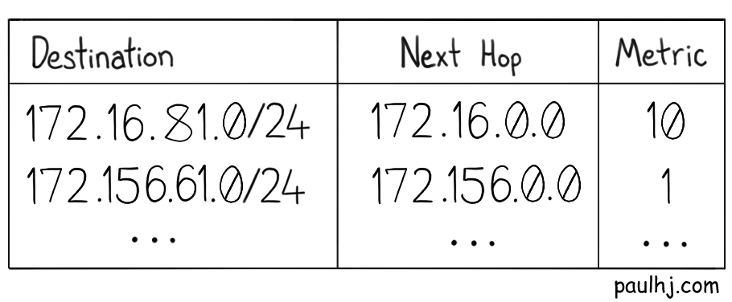

The metric shows the cost of the route, which is a combination of factors such as hop count, traffic, reliability and the size of the MTU. The path a packet takes might even be dictated by some politics of the countries involved. This means that packets onto their destination may take different routes as circumstances change, which has some interesting implications that we’ll discuss when we get to the fourth layer.

To grasp how routing a packet through networks looks like, let’s go through an illustrated example.

Suppose that our network looks like this and a packet wants to get from 172.156.0.0 to 172.16.81.174.
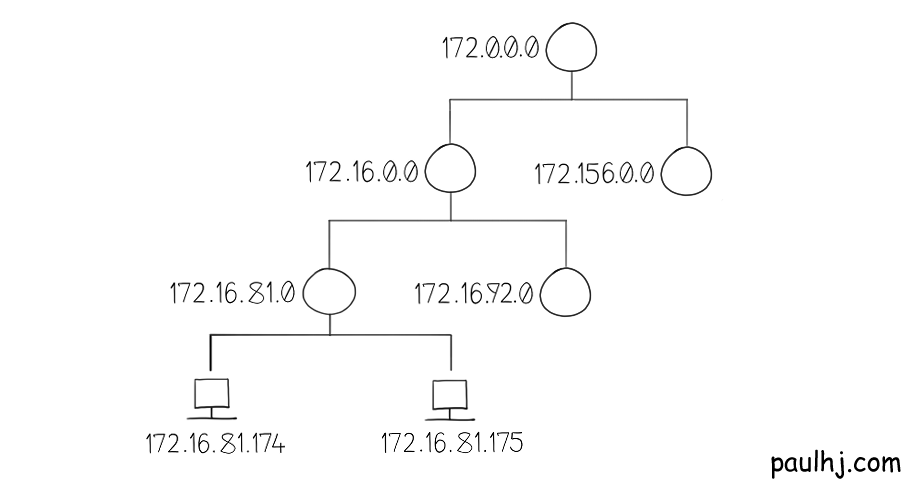

1 - We do our subnet mask operation to get the Network Address.  
2 - 172.156.0.0 has a routing table and finds the destination network, which is 172.16.81.0  
3 - The next hop to reach that destination is 172.0.0.0  
4 - Send the packet there.  
5 - Repeat until you have reached the desired network.

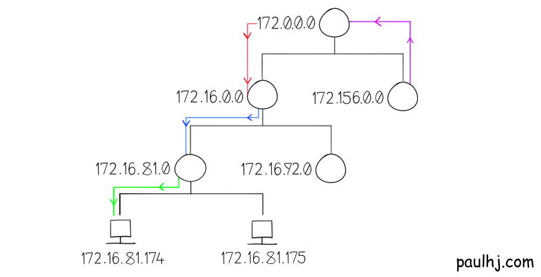

This is basically how routing across the Internet works; apply the Subnet Mask to get the Network Address, match with the destination address in the routing table entry and pass the packet on that entry’s next hop. However, everything we’ve talked about so far is inside of something called an Autonomous System (AS).

##Autonomous System
An AS is basically a set of subnetworks under the administration of one entity (as such an Internet Service Provider). Routing within an AS uses internal protocols such as Interior Border Gateway Protocol (iBGP) while routing between Autonomous Systems (ASes? The alternative without the “e” isn’t an option) is done with external protocols, such as the Border Gateway Protocol (BGP), but the essentials of how a packet is passed along is the same.

The amazing outcome of routing this way means that the Internet has a lot of resiliency. Let’s take for example a group of ASes linked together like so:
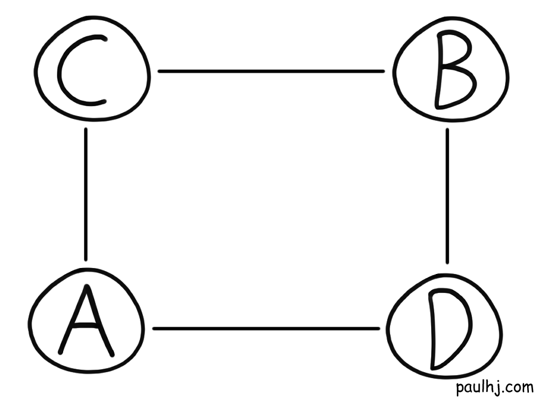

Let’s say a packet has to travel from A to B. Looking at this let’s assume the best path was like so:
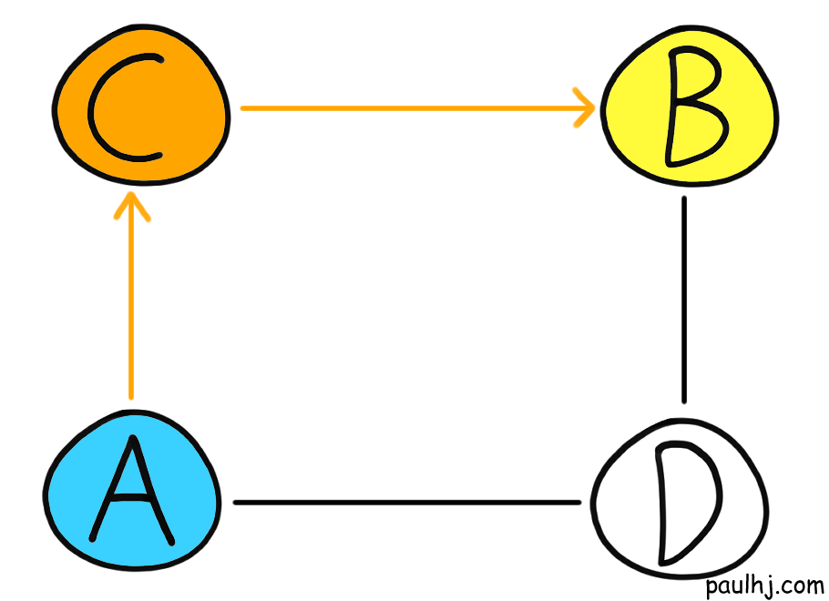

Let’s suppose unfortunately, C goes down and no packet can travel across C. Time to drown like fish? Thankfully no, as the neighbouring Ases have shared routing information and the packet can travel through another route:
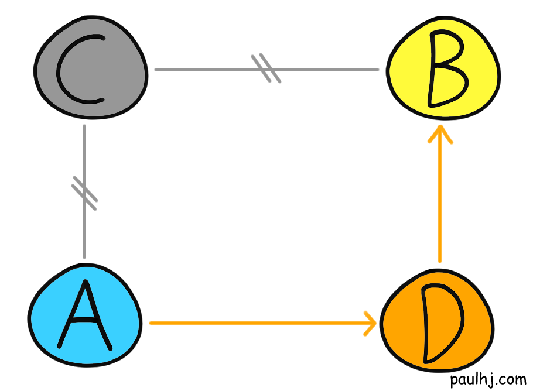

Once arrived at AS B, the packet will find the destination subnetwork using interior protocols and be converted into a frame at the Data-Link layer and arrive at the target device.

As great as this is, what would happen if half the packets you sent when through AS C before it went down? The other half would take a different route and potentially arrive first! For that we need to visit our final enclosure and layer to our onion.

##Transport Layer
Up until now we’ve discussed how our data is split and routed across the Internet - that’s job of the layers one to three. Which leaves us with our final layer, the Transport Layer.

Its job is to layout the etiquette for how two devices talk to each other. Let’s explain this with an example of a Transport layer protocol, the Transmission Control Protocol (TCP).

TCP etiquette wise is an absolute gentleman; ensuring that the data requested gets successfully delivered in full. First off, TCP starts things off between the two devices like true gentlemen, with a handshake. A connection between both the devices is made so that each device can communicate with one another.

The data that needs to be sent is turn into numbered segments (the PDU for TCP) and passed onto the third layer, the Internet Protocol, for delivery. As the segments are numbered, the receiving device can detect whether the incoming packets (with the segments in them) are in order and complete.

Remember that the packets that flow through the Internet can take different routes to reach the same destination; so some packets may never reach the destination or they may arrive in an incorrect order. Due to the numbering, the packets can be rearranged into the correct order and any corrupted packets can be retransmitted. Furthermore, as the receiving device can communicate back, it sends an acknowledgment whenever a packet is received. If the sender doesn’t receive an acknowledgment for a packet within a given time, it will retransmit the packet.

The other big Transport layer protocol we have to talk about is the User Datagram Protocol (UDP). TCP is a fine gentleman and sounds like a jolly good bloke to be around. There’s only one problem. TCP likes to take his time. And sometimes we just can’t have that.

Calls, games, streams and whatever time sensitive communication can be a nightmare over TCP. Handshakes, confirmation, checks and balances - this all takes time. The technical term being an increase in latency; and if you’ve ever played an online game with high latency, then need I say more.

So, there are times when we value speed more than correctness and this is exactly what UDP is for. UDP doesn’t start things off like gentleman TCP, it doesn’t have the time for that. So, a connection with the receiver is never made, making it connectionless.

The data to be sent is split into datagrams (the PDU of UDP) and sent immediately. Unlike TCP, the packets can come in an incorrect order and be lost. As such, TCP is for when you need reliability while UDP is for speed.

Basically, if dining with TCP is akin to dining with a gentleman that ensures their house guest has thoroughly tasted each course, then UDP is more of a buffet sushi train chef that forces you to eat everything that comes through.
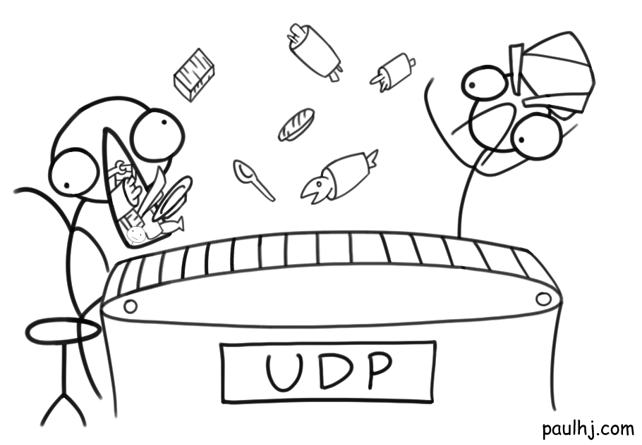

We’ve arrived at the end of our journey together. After visiting myriads of nightmare enclosures, we can leave the zoo with the knowledge of how these creatures unlike us communicate.

So, the next time someone says those words, IP Address, Subnets, Autonomous Systems or the like, you can stay in that conversation knowing you’ve worked from the ground up to understand them.

The modern Internet is a feat of human engineering that manifests our desire as humans to be connected with one another; so, the next time the Internet goes down, don’t just drown like a fish on land. Drown like a fish on land with dignity because I still want my cat videos.